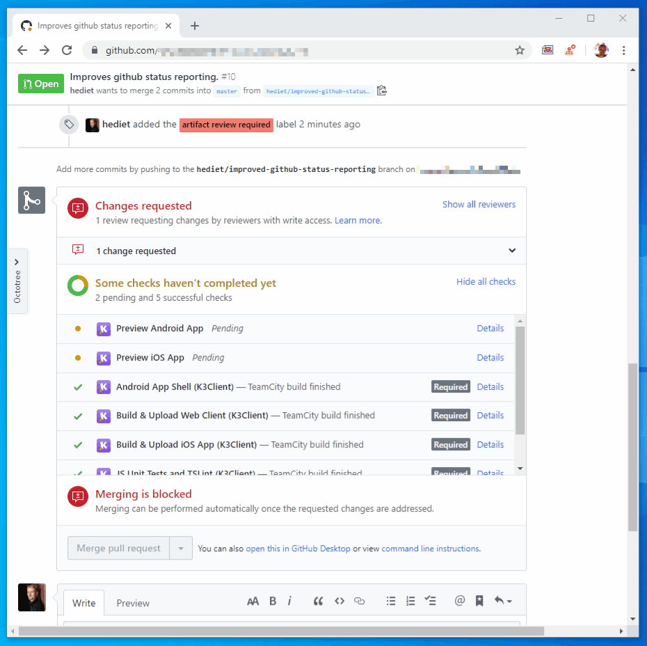
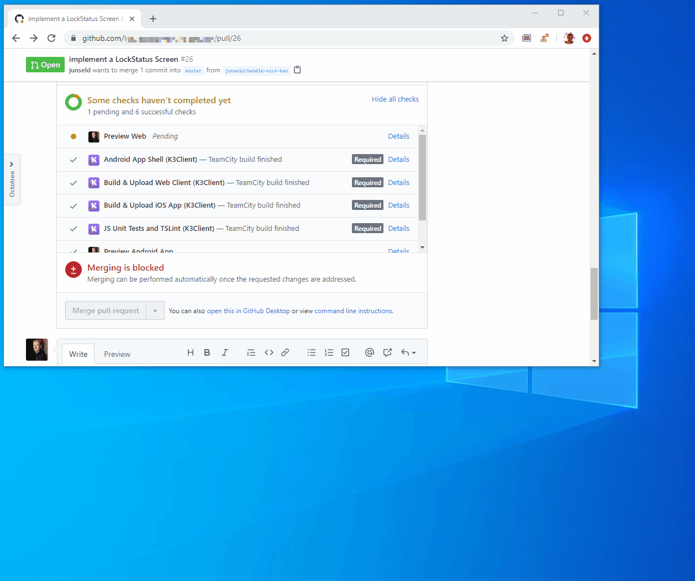

# Manual Status For Github to Review Your Artifacts

This statically hosted tool can be used to establish a workflow for reviewing iframe-embeddable build artifacts on github.

The result of such a review is connected with github status and can be configured to prevent a pull request from being merged.
With this tool, a reviewer can reject or accept a build artifact per commit!

This tool was originally developed by [Knuddels](https://www.knuddels.de) to improve its quality assurance process and was open-sourced in 2020.

## Demo at Knuddels

At Knuddels, we have an iOS and Android App that we build and upload to [Appetize.io](https://appetize.io/) on each commit.
The uploaded artifact can be reviewed with this tool:



We also have a website that can be reviewed with this tool too:



## Usage

This tool is hosted on [https://knuddels.github.io/github-manual-artifact-review-status/](https://knuddels.github.io/github-manual-artifact-review-status/).

You need to configure it by setting the following query parameters:

-   `?context=` Set a unique identifier for your review name, e.g. `iOS App Artifact Review`
-   `&owner=` The repository owner.
-   `&repo=` The repo.
-   `&commitSha=` The SHA of the commit that you want to review.
-   `&subjectUrl=` The url of the build artifact to review. Must be embeddable in an Iframe! You probably need your own artifact repository for that which serves your build artifacts to the web.
-   `&subjectUrlExternal=` The url used for the `Open External URL` button. _(Optional)_
-   `&reviewMessage=` A message for the reviewer. _(Optional)_

The tool asks each reviewer for a Github Token with status access.
Also, the tool preserves the `target_url` of a github status.

### TypeScript

You can use this TypeScript code to compose the URL automatically:

```ts
import { URL } from "url";

interface ManualReviewUrlOptions {
	context: string;
	owner: string;
	repo: string;
	/**
	 * The commit this status is applied to.
	 */
	commitSha: string;
	/**
	 * The url of the artifact to review.
	 * This will be embedded in an iframe.
	 */
	subjectUrl: string;
	/**
	 * An optional external url of the artifact to review.
	 */
	subjectUrlExternal?: string;
	/**
	 * An optional review message.
	 */
	reviewMessage?: string;
}

function buildManualReviewUrl(options: ManualReviewUrlOptions): string {
	// See https://github.com/Knuddels/github-manual-artifact-review-status for source
	const u = new URL(
		"https://knuddels.github.io/github-manual-artifact-review-status/"
	);
	u.searchParams.set("context", options.context);
	u.searchParams.set("owner", "knuddelsgmbh");
	u.searchParams.set("repo", "reactmain");
	u.searchParams.set("commit-sha", options.commitSha);
	u.searchParams.set("subject-url", options.subjectUrl);
	if (options.subjectUrlExternal !== undefined) {
		u.searchParams.set("subject-url-external", options.subjectUrlExternal);
	}
	if (options.reviewMessage !== undefined) {
		u.searchParams.set("review-message", options.reviewMessage);
	}
	return u.toString();
}
```

## CI-Setup

This tool works best with CI automation like Github Actions.
You can use this TypeScript code to post an initial github status from your CI,
with a details link pointing to this tool:

```ts
import { Octokit } from "@octokit/rest"; // Add this to your dependencies.
import { execSync } from "child_process";

async function postManualReviewGithubStatus(args: {
	context: string;
	description?: string;
	subjectUrl: string;
	subjectUrlExternal?: string;
}): Promise<void> {
	// Ensure that process.env.GH_TOKEN is a valid github token that can post a new status!
	const githubAuthToken = process.env.GITHUB_TOKEN;
	const octokit = new Octokit({
		auth: githubAuthToken,
		log: {
			debug: () => {},
			info: () => {},
			warn: console.warn,
			error: console.error,
		},
	});

	const repoInfo = {
		owner: "CONFIGURE THE REPO OWNER HERE",
		repo: "CONFIGURE THE REPO NAME HERE",
	};
	const info = getCurrentCommitInfo();

	const statusTargetUrl = buildManualReviewUrl({
		...repoInfo,
		context: args.context,
		commitSha: info.sha,
		subjectUrl: args.subjectUrl,
		subjectUrlExternal: args.subjectUrlExternal,
		reviewMessage: `Reviewing ${info.branch}`,
	});

	await octokit.repos.createStatus({
		...repoInfo,
		state: "pending", // status defaults to "pending"
		sha: info.sha,
		description: args.description,
		target_url: statusTargetUrl,
		context: args.context,
	});
}

function getCurrentCommitInfo(): { sha: string; branch: string } | undefined {
	try {
		const sha = execSync("git rev-parse HEAD", { encoding: "utf8" }).trim();
		const branch = execSync("git rev-parse --abbrev-ref HEAD", {
			encoding: "utf8",
		}).trim();
		return {
			sha,
			branch,
		};
	} catch (e) {
		console.error(e);
		return undefined;
	}
}
```

This is how an interaction between the reviewer, github and this tool could look like:


## Release

To release a new version of this tool, just push to master.
A github action is configured to build the webpack app and to publish it automatically to github pages.
